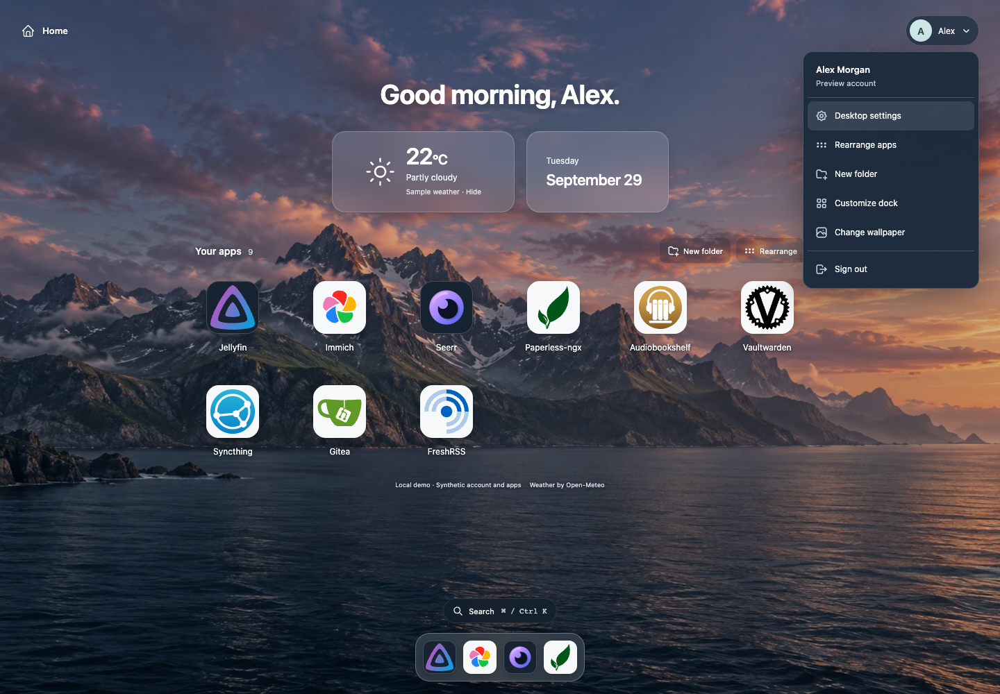
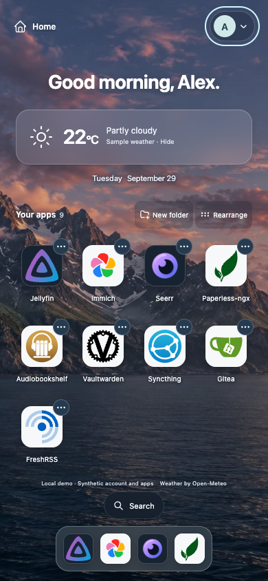
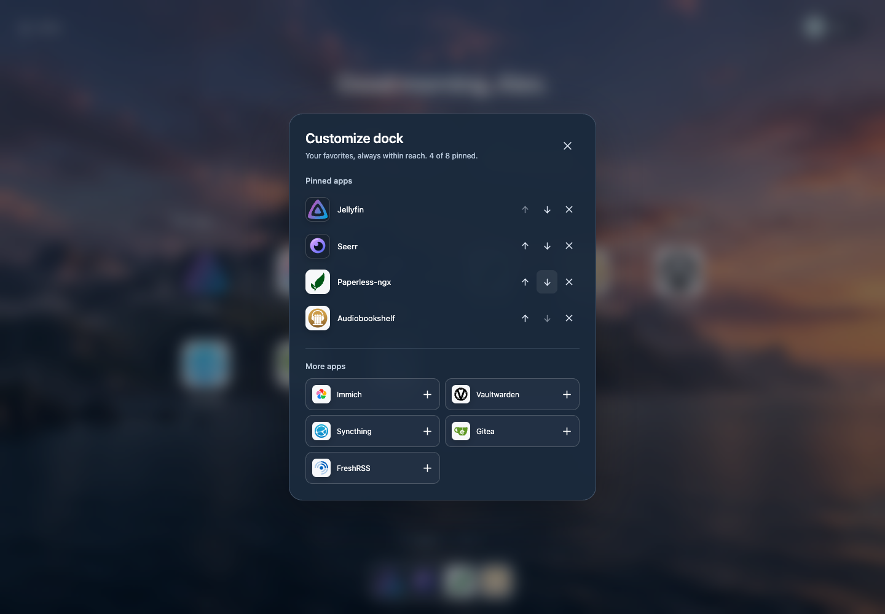
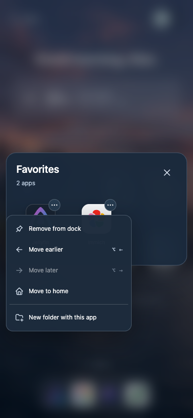

# Personal desktop revision

This revision moves the account control to the top right and puts Settings and
Sign out in its dropdown. The dock contains application shortcuts only; search
has its own button. It replaces tinted generic app glyphs with unmodified official
artwork on neutral display surfaces, keeping each image’s native colors and shape.

The public demo uses Alex Morgan and nine illustrative applications at reserved
`example.com` addresses. It is separate from any deployed catalog or real account.

## Interactions to review

- Account menu: Settings, rearrange, new folder, dock customization, wallpaper and
  sign out; arrow keys, Home/End and Escape work inside menus.
- Launcher: drag, use the options menu, or enable Rearrange for visible movement
  buttons. Alt + Left/Right moves the focused app or folder.
- Folders: create from selected apps, move apps between folders and the desktop,
  reorder, rename, and remove a folder while preserving its apps.
- Search: Cmd/Ctrl + K opens and closes search; arrow keys select a result, Enter
  opens it, and Escape closes it and returns focus.
- Dock: pin, remove and reorder favorites, including by dragging, with an eight-app
  limit. Settings and the account control are outside the dock.
- Wallpaper: choose Landscape, Midnight or Dusk. Preferences follow the existing
  account identity across separate browser contexts.
- Recovery: a stale preference revision keeps entered folder data, displays the
  error inside the active dialog, and offers a reachable Refresh layout action.

## Validation

The production frontend build, TypeScript checks and all 27 existing server tests
passed. All 12 browser scenarios passed in Chromium 154. Browser checks use isolated contexts and the loopback-only
synthetic demo at 320, 390, 768 and 1440 pixel widths, including touch contexts.
They check account placement, loaded artwork, keyboard and modal focus, menu
visibility, folders, drag and button reordering, search, dock customization,
wallpapers, preference persistence and the existing weather opt-in behavior.
Additional regressions cover app IDs that match menu names, a real two-browser
409 conflict with retained draft and successful refresh/retry, and full-dock
limits at phone sizes. No unexpected page, console or HTTP errors remained.
The suite observes the server’s advertised rate-limit reset between cases.

Selected screenshots below are actual rendered captures. They are review evidence,
not visual mocks. The full generated browser evidence stays outside this repository.

## Screenshots

### Desktop and account menu — 1440 pixels

### Phone — 390 pixels

### Dock customization

### Folder options on touch

## Reference and asset boundaries

The comparison used [Umbrel’s published 2.0 interface](https://umbrel.com/umbrelos),
its [personalization guide](https://umbrel.com/support/basics/personalizing-your-umbrel),
and the exact public [2.0.0 desktop source](https://github.com/getumbrel/umbrel/tree/2.0.0/packages/ui/src/modules/desktop)
for behavioral reference. Its public demo returned 404 during review, so no live
interaction parity is claimed. No Umbrel source code or artwork is included.

The top-right account menu, personal folders, manual app ordering and customizable
app dock are explicitly requested dashboard behavior. They should not be presented
as exact Umbrel 2.0 behavior: that version sorts its desktop and has a fixed system
dock, including Settings.

The [official artwork manifest](../licenses/brand-assets.md) records 16 original
assets, immutable upstream revisions, hashes and retained licenses. Grafana,
Nextcloud and Home Assistant artwork is not bundled under this distribution’s
asset policy; those IDs display neutral initials. Application code remains MIT,
and third-party artwork retains its own licenses.

Production authentication, server authorization, CSRF handling, preference
ownership, revision checks and API contracts are preserved. This is a source-only
review branch: no chart changes, image publication, release or deployment.
