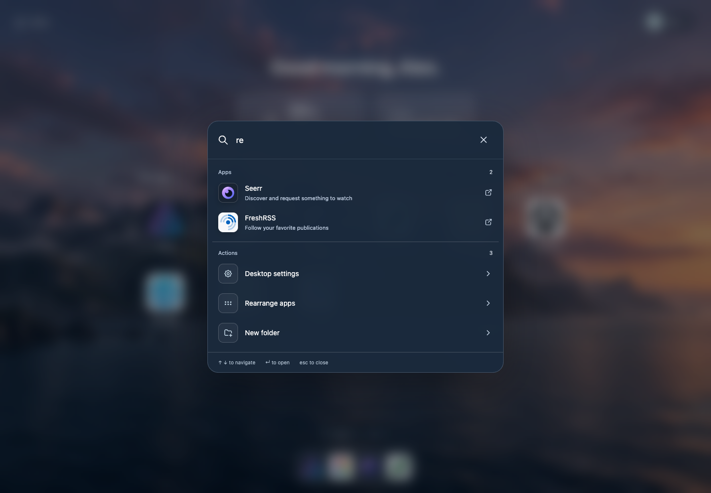
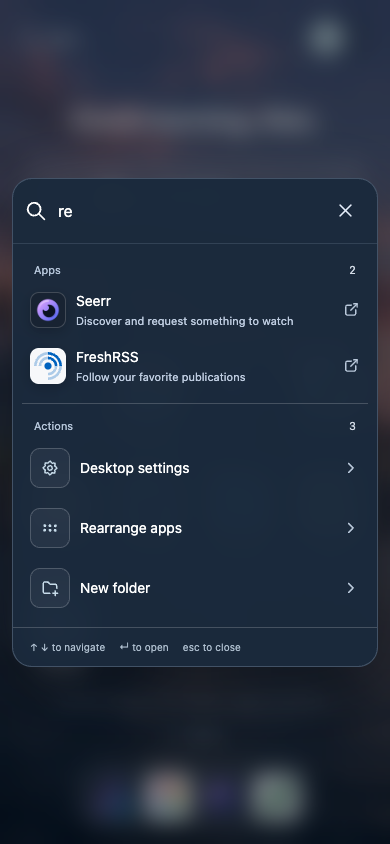
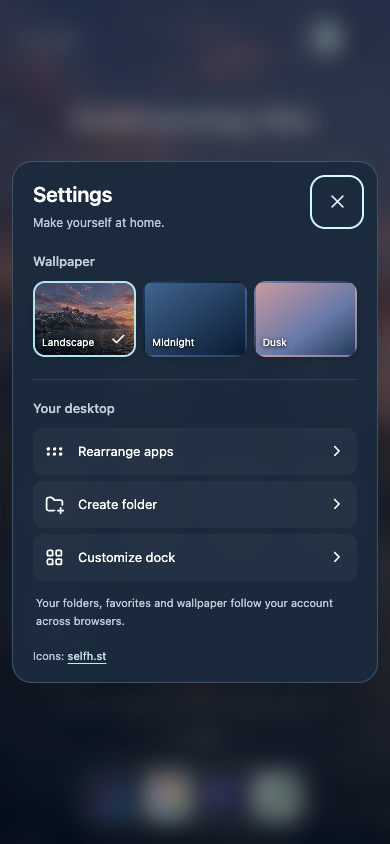
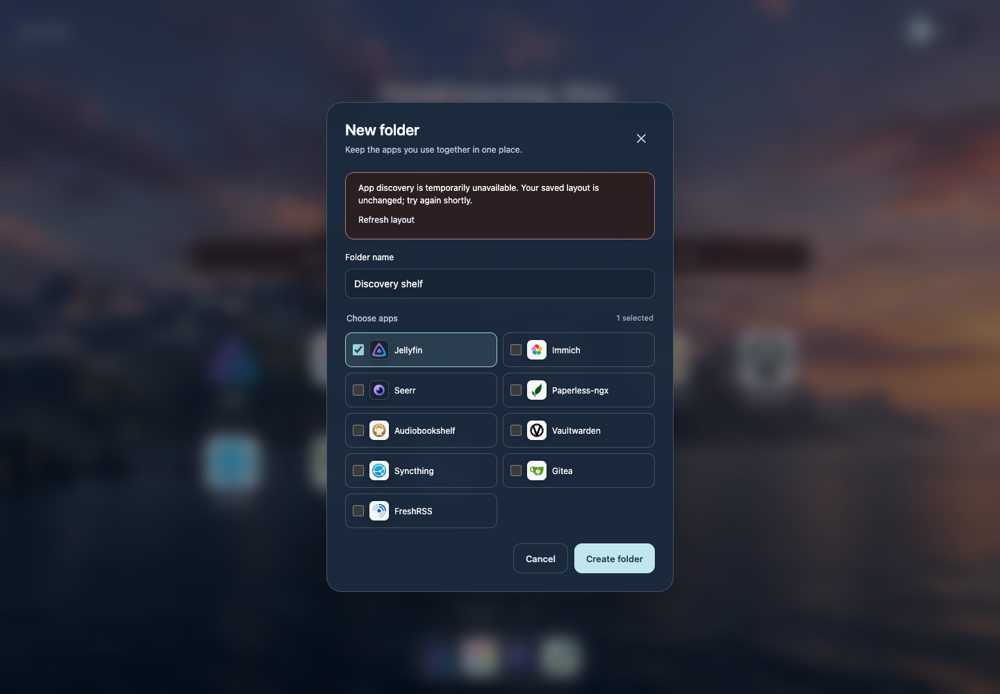

# Dynamic icons, discovery and desktop action search

The 0.2.0 source extends the existing desktop with automatic icon lookup,
permission-aware route discovery, and app/action search. Review images use only
the synthetic demo account and generic app list.

## Desktop and mobile search

Apps and actions are grouped; typing filters both. Arrow keys and Enter use the
same result order, skip unavailable actions, and open the selected settings dialog.
Closing that dialog returns focus to the original search trigger.

## Icon attribution

Settings links to the selfh.st collection. Dynamic images resolve from its index;
missing or failed images fall back to configured local artwork, bundled artwork,
then initials. A per-app local-only option skips external lookup.

## Verification boundaries

The full 16-case browser suite passed on isolated loopback Chromium, including
all prior desktop/folder/dock/weather/save-conflict checks and four new search/icon
cases. After strengthening recovery saves, the affected conflict case and a new
catalog-revision/outage-recovery case both passed against the final build. The
suite now contains 17 cases. CDN responses are deterministic fixtures backed by the
existing local artwork. The tests verify remote URL selection, one shared index
request, decoded images, failure fallback, keyboard behavior and dialog focus.
They do not claim continuous availability of the external CDN.

All 131 unit/API tests pass. The discovery module and API tests use synthetic identities, routes, snapshots and
HTTP transports to verify access isolation, route changes, revocation, stale or
invalid sources, duplicate IDs and layout recovery. Helm validation checks both
enabled modes and credential-free defaults. Real Kubernetes, OIDC and downstream
app acceptance remain deployment-specific; this source review does not claim a
live cluster deployment.

An additional smoke check launched the built production entry point on isolated
loopback with synthetic file snapshots. It verified initial discovery, invalid
source removal, 503 save protection, recovery with a stale-save 409, preserved
folder/dock contents, and app removal without a process restart. Static apps
remained available throughout.

